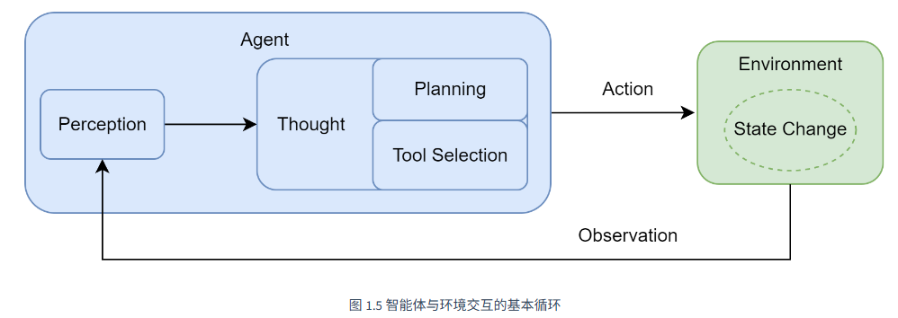
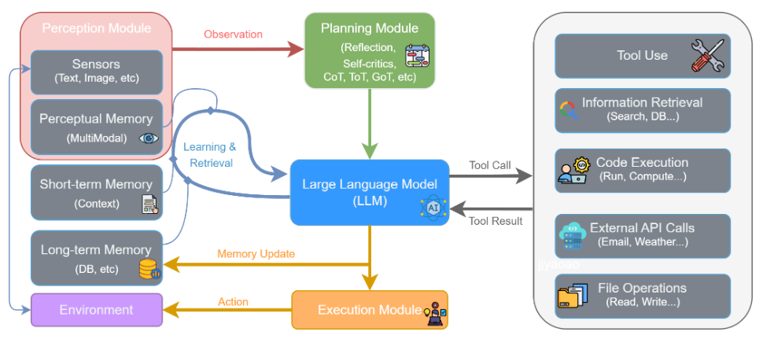

#  从零开始构建智能体系统原理与实践

## 一、智能体概念

在人工智能领域，智能体被定义为任何能够通过传感器（Sensors）感知其所处环境（Environment），并自主地通过执行器（Actuators）采取行动（Action）以达成特定目标的实体。

智能体并非一次性完成任务，而是通过一个持续的循环与环境进行交互，这个核心机制被称为 智能体循环 (Agent Loop)。该循环描述了智能体与环境之间的动态交互过程，构成了其自主行为的基础。

循环主要包含以下几个相互关联的阶段：

1. 感知 (Perception)：这是循环的起点。智能体通过其传感器（例如，API的监听端口、用户输入接口）接收来自环境的输入信息。这些信息，即观察 (Observation)，既可以是用户的初始指令，也可以是上一步行动所导致的环境状态变化反馈。
2. 思考 (Thought)：接收到观察信息后，智能体进入其核心决策阶段。对于LLM智能体而言，这通常是由大语言模型驱动的内部推理过程。如图所示，“思考”阶段可进一步细分为两个关键环节：
    1. 规划 (Planning)：智能体基于当前的观察和其内部记忆，更新对任务和环境的理解，并制定或调整一个行动计划。这可能涉及将复杂目标分解为一系列更具体的子任务。
    2. 工具选择 (Tool Selection)：根据当前计划，智能体从其可用的工具库中，选择最适合执行下一步骤的工具，并确定调用该工具所需的具体参数。
3. 行动 (Action)：决策完成后，智能体通过其执行器（Actuators）执行具体的行动。这通常表现为调用一个选定的工具（如代码解释器、搜索引擎API），从而对环境施加影响，意图改变环境的状态。

行动并非循环的终点。智能体的行动会引起环境 (Environment) 的状态变化 (State Change)，环境随即会产生一个新的观察 (Observation) 作为结果反馈。这个新的观察又会在下一轮循环中被智能体的感知系统捕获，形成一个持续的“感知-思考-行动-观察”的闭环。智能体正是通过不断重复这一循环，逐步推进任务，从初始状态向目标状态演进。

## 二、智能体分类与发展

与作为工具辅助人类不同，自主协作者模式将智能体的自动化程度提升到了一个全新的层次。

在这种模式下，我们不再是手把手地指导AI完成每一步，而是将一个高层级的目标委托给它。智能体会像一个真正的项目成员一样，独立地进行规划、推理、执行和反思，直到最终交付成果。这种从助手到协作者的转变，使得LLM智能体更深的进入了大众的视野。它标志着我们与AI的关系从“命令-执行”演变为“目标-委托”。智能体不再是被动的工具，而是主动的目标追求者。

主流方向：

1. 单智能体自主循环：这是早期的典型范式，如 AgentGPT 所代表的模式。其核心是一个通用智能体通过“思考-规划-执行-反思”的闭环，不断进行自我提示和迭代，以完成一个开放式的高层级目标；
2. 多智能体协作：这是当前最主流的探索方向，旨在通过模拟人类团队的协作模式来解决复杂问题。它又可细分为不同模式： 角色扮演式对话：如 CAMEL 框架，通过为两个智能体（例如，“程序员”和“产品经理”）设定明确的角色和沟通协议，让它们在一个结构化的对话中协同完成任务。 组织化工作流：如 MetaGPT 和 CrewAI，它们模拟一个分工明确的“虚拟团队”（如软件公司或咨询小组）。每个智能体都有预设的职责和工作流程（SOP），通过层级化或顺序化的方式协作，产出高质量的复杂成果（如完整的代码库或研究报告）。AutoGen 和 AgentScope 则提供了更灵活的对话模式，允许开发者自定义智能体间的复杂交互网络。
3. 高级控制流架构：诸如 LangGraph 等框架，则更侧重于为智能体提供更强大的底层工程基础。它将智能体的执行过程建模为状态图（State Graph），从而能更灵活、更可靠地实现循环、分支、回溯以及人工介入等复杂流程。

工作流 workflow 与 智能体 Agent的区别：

工作流是一种传统的自动化范式，其核心是对一系列任务或步骤进行预先定义的、结构化的编排。它本质上是一个精确的、静态的流程图，规定了在何种条件下、以何种顺序执行哪些操作。

基于大型语言模型的智能体是一个具备自主性的、以目标为导向的系统。它不仅仅是执行预设指令，而是能够在一定程度上理解环境、进行推理、制定计划，并动态地采取行动以达成最终目标。

强化学习赋予了智能体从交互中学习决策策略的能力，但这通常需要海量的、针对特定任务的交互数据，导致智能体在学习之初缺乏先验知识，需要从零开始构建对任务的理解。

大模型的涌现能力（Emergent Abilities）包含了上下文学习（In-context Learning）和 思维链（Chain-of-Thought）推理能力。
这些能力的出现，标志着LLM不再仅仅是一个语言模型，它已经演变成了一个兼具海量知识库和通用推理引擎双重角色的组件。

智能体发展的历史长河中，几大关键的技术拼图已经悉数登场：符号主义提供了逻辑推理的框架，联结主义和强化学习提供了学习与决策的能力，而大型语言模型则提供了前所未有的、通过预训练获得的世界知识和通用推理能力。

## 三、基于大模型的智能体

随着大型语言模型技术的飞速发展，以LLM为核心的智能体已成为人工智能领域的新范式。它不仅能够理解和生成人类语言，更重要的是，能够通过与环境的交互，自主地感知、规划、决策和执行任务。

智能体与环境的交互可以被抽象为一个核心循环。LLM驱动的智能体通过一个由多个模块协同工作的、持续迭代的闭环流程来完成任务。

1. **感知 (Perception)**
   流程始于**感知模块 (Perception Module)**。它通过传感器从**外部环境 (Environment)** 接收原始输入，形成**观察 (Observation)**。这些观察信息（如用户指令、API 返回的数据或环境状态的变化）是智能体决策的起点，处理后将被传递给思考阶段。

2. **思考 (Thought)**
   这是智能体的认知核心，对应图中的**规划模块 (Planning Module)** 和**大型语言模型 (LLM)** 的协同工作。

   * **规划与分析**：首先，规划模块接收观察信息，进行高层策略推理。它通过**反思 (Reflection)** 和**自我批判 (Self-criticism)** 等机制，将宏观目标分解为更具体、可执行的步骤。
   * **推理与决策**：随后，作为中枢的 LLM 接收来自规划模块的指令，并与**记忆模块 (Memory)** 交互以整合历史信息。LLM 进行深度推理，最终决策出下一步要执行的具体操作，这通常表现为一个**工具调用 (Tool Call)**。

3. **行动 (Action)**
   决策完成后，便进入行动阶段，由**执行模块 (Execution Module)** 负责。LLM 生成的工具调用指令被发送到执行模块。该模块解析指令，从**工具箱 (Tool Use)** 中选择并调用合适的工具（如代码执行器、检索引擎、API 等）来与环境交互执行任务。这与环境的实际交互过程就是智能体的**行动 (Action)**。

4. **观察 (Observation)**
   与循环首尾呼应：行动会改变环境状态，并产生新的观察信息。

   * 工具执行后会返回一个**工具结果 (Tool Result)** 给 LLM，这不仅包含行动的有效反馈与质量信息，同时，智能体的行动改变了环境，从而产生了一个全新的**环境状态**。
   * 这个“工具结果”和“新的环境状态”共同构成了一轮全新的**观察 (Observation)**。这个新的观察会被感知模块再次捕获，同时 LLM 会根据行动结果**更新记忆 (Memory Update)**，从而启动下一轮的“感知–思考–行动”的循环。

